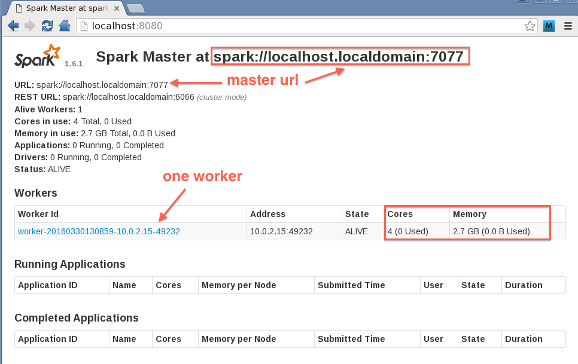

<link rel='stylesheet' href='../assets/main.css'/>

<!-- [<< back to main index](../README.md)  -->

## Lab First Look at Spark Shell

### Overview
In this lab, we will become familiar with the lab environment, set up Spark, and start a Spark cluster.  We will be running Spark with only a single node.

* Open a terminal window (use icon on desktop)
* Type or copy/paste the following commands in the terminal window
  * Do not include $ in your commands
  * Use the correct filenames for the version of spark currently used in the labs
* We'll access the Spark Shell via Zeppelin as usual and create some RDDs
* We'll perform some simple operations on them, and start the Spark shell and connect to a separate cluster

##### Tasks

* Execute the following in a terminal window
  * If prompted for a password when starting Spark up, supply the student password you used to log into the VM
  * You should see output similar to that below

```bash
$   cd ~/spark
$   ./sbin/start-all.sh
starting org.apache.spark.deploy.master.Master, logging to /home/student/spark/logs/spark-student-org.apache.spark.deploy.master.Master-1-localhost.localhome.out
localhost: starting org.apache.spark.deploy.worker.Worker, logging to /home/student/logs/spark-student-org.apache.spark.deploy.worker.Worker-1-localhost.localdomain.out

```

* Verify Spark is running by 'jps' command
* jps lists the instrumented Java Virtual Machines (JVMs) on the target system.
* The command and output will look something like the following.

```bash
  $  jps
  30624 Jps
  30431 Master
  30565 Worker
```
You will see **Master** and **Worker**  processes running.
(You will get different values for process ids - first column )

The Spark UI will be at port 8080 of the host.

* In a browser window go to:  **http://localhost:8080** OR **http://your-spark-host-address:8080**
* Be sure to use the 'public' ip address

Bingo!  Now we have spark running.

Explore Spark UI

The Spark UI should look similar to the screen shot below

 

To explore, consider or do the following:

* Are the Master and Worker running on the same node?
* Inspect the memory & CPU available for the Spark worker
* Note the Spark master URI, it will be something like

  spark://host_name:7077 (We will need this for later labs)


---------------------
Work with the Spark context
---------------------
Within Zeppelin, we've set the default interpreter binding to be Spark 2.  Anything you type there without specifiying an interpreter (e.g. `%sh` for the OS shell), will default to being interpreted by the Spark 2 shell. Within that shell, the variable `sc` refers to the SparkContext.

>NOTE: we illustrate the prompt in the Zeppelin interpreter as **`>`**, as shown in the examples below. This is to make it easier in the lab instructions to identity things that you need to type.

#### Tasks

* Type `sc RETURN` in Zeppelin and see what happens.

Your output might look like this

```
> sc
res0: org.apache.spark.SparkContext = org.apache.spark.SparkContext@5019fb90
```

```
> sc
res0: org.apache.spark.SparkContext = org.apache.spark.SparkContext@5019fb90
```

**Tab completion**: 

* To see all methods of the sc variable, type `sc`  followed by `TAB`
  * This will show all the available methods on `sc`.

**Try the following**:

 * Print the **application name** of the SparkContext, 
   * `sc.appName`
 * Display the 'Spark master' for the shell 
   * `sc.master`

--------------------------------
Explore the Spark shell UI
--------------------------------
#### Tasks

* Open the FireFox browser, and go to the bookmark **Spark_UI**
	* In the page that opens, look for the application named **Zeppelin**
	* On that row, find the **Tracking UI** column, and click the **Application Master** link in that column
	* That should open the Spark UI

Below is a sample screen shot of the UI

**NOTE:** In all screen shots, you might see differences in job ids, stage ids and other details that depend on the exact state of your Spark shell.  This is because the shell used for the screen shots is likely to have executed a different overall sequence of transformations than your shell since it was started.  This is not important - the important details should be easily recognizable.


* **Explore** the Stages, Storage, Environment, and Executors tabs

* Take note of the 'Event Timeline', we will use this for monitoring our jobs later


-------------------
Load a file and process its contents
-------------------
Lab files are located on an HDFS file system, under `spark-labs`.  These are accessible by simple paths such as "`spark-labs/data/twinkle/sample.txt`".  You can also access filess on the local file system, if needed, using paths with a file scheme - e.g. "`file:///my-path/my-file.txt`". 

Because we're working with HDFS, we will occassionaly need to use Hadoop commands to access lab files.  We'll supply the complete commands as needed, and there is no need for you to have any knowledge of HDFS or Hadoop.

For this part of the lab, we'll use the test file :  `spark-labs/data/twinkle/sample.txt` which contains a nursery rhyme:

```
twinkle twinkle little star
how I wonder what you are
up above the world so high
like a diamond in the sky
twinkle twinkle little star
```

#### Tasks

* Load the file in the Spark shell as follows:

```
> val f = sc.textFile("spark-labs/data/twinkle/sample.txt")
```

#### Answer the following questions:
* **What is the 'type' of f ?**
 * hint : type `f` on the console

* **Inspect the Spark Shell UI on port 4040, do you see any processing (i.e. jobs) done?  Why (not)?**  
 * We'll discuss this later - work is executed lazily with Spark

* **Print the first line / record from the RDD**  
 * hint : `f.first()`

* **Refresh the Spark Shell UI on port 4040 and inspect it.  Do you see any processing (jobs) done?  Why (not)?**  
 * We've asked for some result data - Spark can no longer be lazy !

* **Print the first 3 lines of the RDD.**  
 * hint : `f.take(???)`  (Provide the correct argument to the take function.)

* **Refresh the Spark Shell UI on port 4040 and inspect it.  Do you see any processing (jobs) done?  Why (not)?**  

* **Get all the content from the file.**  
 * hint : `f.collect()`

* **How many lines are in the file?**  
 * hint : `f.count()`

* **Refresh the Spark Shell UI on port 4040 and inspect the 'Jobs' section in it**
 * Also inspect the event time line


* **Inspect the 'Executor' section** in the Shell UI (in your browser)


* **Quit the spark-shell session** 
 * `Control + D` or `:quit`


-------------------------------------------
Connecting a Standalone Shell to the Spark Cluster
-------------------------------------------
#### Tasks

* Go to the sandbox terminal window, and execute the following

##### Start the spark shell

* In your terminal prompt, start the Spark Shell as follows (at command prompt in */spark-training*)

```
# spark-shell --master yarn --deploy-mode client
```


* Once the shell has started, check its UI
	* Note that it may be at another port (e.g. 4041) if there is already a Spark context using port 4040

#### Spark shell UI at port 4040


----------------------------------------
Load a file and process its contents in the new shell
----------------------------------------
Now our shell is connected to our server

#### Tasks

* Load the *data/twinkle/sample.txt* file as in the earlier part of this lab.
	* Redo some of the operations you executed in that part of the lab.
	* e.g. Get the first line of the file.

-------------------------------------------
Stop the Shell
-------------------------------------------
We'll use a Zeppelin for mos of the labs

#### Tasks

* Quit the running spark-shell session.
 * `Control + D`


### Results

You've worked with the Spark shell, and executed some simple operations.  Now that you're a bit familiar with Spark, we'll start digging into its processing capabilities. 

 

<div style="page-break-after: always;"></div>
